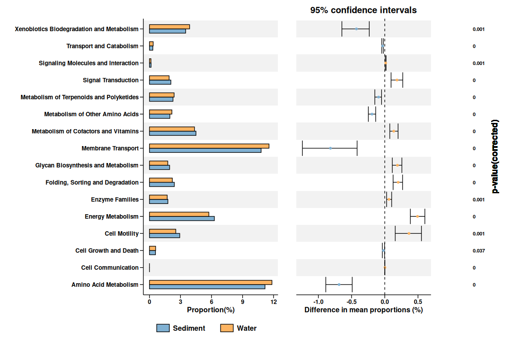

<!-- README.md is generated from README.Rmd. Please edit that file -->

# stamp4r

<!-- badges: start -->
<!-- badges: end -->

The goal of stamp4r is to find diffrent features and plot extended
errorbar plot.

## Installation

You can install the development version of stamp4r like so:

``` r
devtools::install_github("wangzhichao1990/stamp4r)
```

## Example

``` r
library(stamp4r)
## create a stamp object
obj <- stamp$new(feature_table = feature_table, metadata = metadata)

## cal diff
obj$cal_diff()
#> Joining with `by = join_by(SampleID)`
#> Warning in wilcox.test.default(x = DATA[[1L]], y = DATA[[2L]], ...):
#> 无法精確計算带连结的p值
#> Warning in wilcox.test.default(x = DATA[[1L]], y = DATA[[2L]], ...):
#> 无法精確計算带连结的置信区间
#> # A tibble: 23 × 9
#>    Pathway   estimate stati…¹  p.value conf.low conf.h…² method alter…³ p.adjust
#>    <chr>        <dbl>   <dbl>    <dbl>    <dbl>    <dbl> <chr>  <chr>      <dbl>
#>  1 Energy M…  4.93e-3    1260 4.48e-16  3.85e-3  6.04e-3 Wilco… two.si… 1.03e-14
#>  2 Cell Com…  2.36e-5    1286 6.82e-13 -8.7 e-7  2.36e-5 Wilco… two.si… 7.85e-12
#>  3 Amino Ac… -6.88e-3     141 5.63e-10 -8.89e-3 -4.91e-3 Wilco… two.si… 4.32e- 9
#>  4 Metaboli… -1.92e-3     151 1.46e- 9 -2.47e-3 -1.37e-3 Wilco… two.si… 8.40e- 9
#>  5 Folding,…  2.02e-3    1078 3.49e- 7  1.25e-3  2.68e-3 Wilco… two.si… 1.61e- 6
#>  6 Glycan B…  1.91e-3    1051 2.20e- 6  1.13e-3  2.58e-3 Wilco… two.si… 8.43e- 6
#>  7 Transpor… -3.26e-4     267 8.67e- 6 -4.50e-4 -2.10e-4 Wilco… two.si… 2.85e- 5
#>  8 Metaboli…  1.35e-3    1022 1.31e- 5  7.59e-4  2.00e-3 Wilco… two.si… 3.77e- 5
#>  9 Membrane… -8.18e-3     315 1.22e- 4 -1.24e-2 -4.17e-3 Wilco… two.si… 3.11e- 4
#> 10 Metaboli… -9.37e-4     320 1.56e- 4 -1.50e-3 -4.94e-4 Wilco… two.si… 3.60e- 4
#> # … with 13 more rows, and abbreviated variable names ¹​statistic, ²​conf.high,
#> #   ³​alternative
obj$diff |> head()
#> # A tibble: 6 × 9
#>   Pathway    estimate stati…¹  p.value conf.low conf.h…² method alter…³ p.adjust
#>   <chr>         <dbl>   <dbl>    <dbl>    <dbl>    <dbl> <chr>  <chr>      <dbl>
#> 1 Energy Me…  4.93e-3    1260 4.48e-16  3.85e-3  6.04e-3 Wilco… two.si… 1.03e-14
#> 2 Cell Comm…  2.36e-5    1286 6.82e-13 -8.7 e-7  2.36e-5 Wilco… two.si… 7.85e-12
#> 3 Amino Aci… -6.88e-3     141 5.63e-10 -8.89e-3 -4.91e-3 Wilco… two.si… 4.32e- 9
#> 4 Metabolis… -1.92e-3     151 1.46e- 9 -2.47e-3 -1.37e-3 Wilco… two.si… 8.40e- 9
#> 5 Folding, …  2.02e-3    1078 3.49e- 7  1.25e-3  2.68e-3 Wilco… two.si… 1.61e- 6
#> 6 Glycan Bi…  1.91e-3    1051 2.20e- 6  1.13e-3  2.58e-3 Wilco… two.si… 8.43e- 6
#> # … with abbreviated variable names ¹​statistic, ²​conf.high, ³​alternative
## filter diff features
obj$filter_diff_features()
#>  [1] "Energy Metabolism"                        
#>  [2] "Cell Communication"                       
#>  [3] "Amino Acid Metabolism"                    
#>  [4] "Metabolism of Other Amino Acids"          
#>  [5] "Folding, Sorting and Degradation"         
#>  [6] "Glycan Biosynthesis and Metabolism"       
#>  [7] "Transport and Catabolism"                 
#>  [8] "Metabolism of Cofactors and Vitamins"     
#>  [9] "Membrane Transport"                       
#> [10] "Metabolism of Terpenoids and Polyketides" 
#> [11] "Signal Transduction"                      
#> [12] "Cell Motility"                            
#> [13] "Signaling Molecules and Interaction"      
#> [14] "Xenobiotics Biodegradation and Metabolism"
#> [15] "Enzyme Families"                          
#> [16] "Cell Growth and Death"
obj$diff_features
#>  [1] "Energy Metabolism"                        
#>  [2] "Cell Communication"                       
#>  [3] "Amino Acid Metabolism"                    
#>  [4] "Metabolism of Other Amino Acids"          
#>  [5] "Folding, Sorting and Degradation"         
#>  [6] "Glycan Biosynthesis and Metabolism"       
#>  [7] "Transport and Catabolism"                 
#>  [8] "Metabolism of Cofactors and Vitamins"     
#>  [9] "Membrane Transport"                       
#> [10] "Metabolism of Terpenoids and Polyketides" 
#> [11] "Signal Transduction"                      
#> [12] "Cell Motility"                            
#> [13] "Signaling Molecules and Interaction"      
#> [14] "Xenobiotics Biodegradation and Metabolism"
#> [15] "Enzyme Families"                          
#> [16] "Cell Growth and Death"

## extended errorbar plot
obj$plot_extended_errorbar()
#> Joining with `by = join_by(SampleID)`
```


